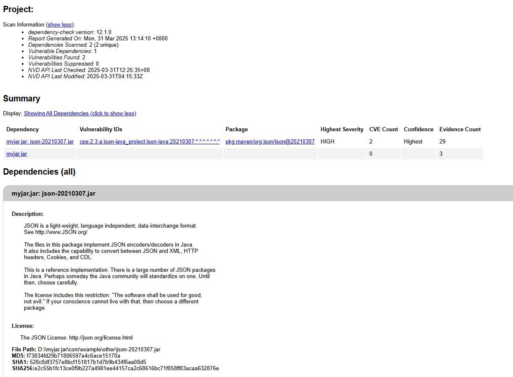
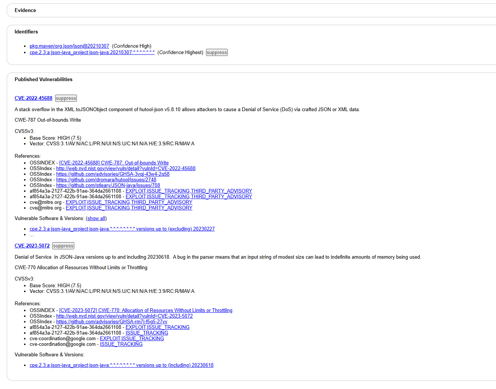
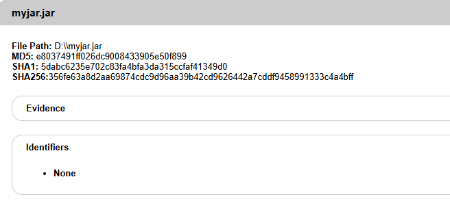

# code2flow-in-java   
## 介绍
  本项目用java语言实现了Code2flow。  
  Code2flow是一款基于python的代码可视化工具，其核心能力在于通过解析抽象语法树（AST）构建函数调用关系图，支持 Python、JavaScript、Ruby、PHP 等动态语言，通过解析代码的抽象语法树（AST）自动生成流程图或调用关系图，直观展示函数调用、条件分支（如 if/else）、循环结构（如 for/while）等逻辑。它可分析单个文件或整个项目目录，递归识别跨文件的函数调用链，并支持导出为 PNG、SVG、PDF 等格式。该工具提供命令行接口和编程 API，允许自定义流程图样式（如节点颜色、布局方向）和过滤机制（如排除测试文件或冗余函数），适用于代码审查、教学演示、项目架构分析等场景。  
  随着开发者社区的持续贡献，未来计划进一步突破语言类型限制，探索对C++、Go等编译型语言的支持，使工具逐步演变为通用型代码逻辑分析平台，为多语言混合项目提供全景式的调用依赖透视

## 基本算法
1. 把源代码文件翻译成语法树
将源代码转换为语法树时，通过解析器对代码进行词法分析和语法分析，生成抽象语法树（AST）。AST的每个节点对应代码中的具体元素（如函数、变量、条件分支），并记录其语法结构关系。过程中需处理语言特定的语法规则（如Python缩进、Ruby块语法），通过遍历AST识别函数定义的位置及作用域，同时标记上下文。
2. 找到所有的函数定义。
在遍历语法树（AST）时，依据语言特性识别函数定义节点。Python的def关键字。通过解析器提取函数名、参数列表及作用域范围，同时处理嵌套定义。识别过程中需建立函数与所属命名空间（模块、类）的映射关系，并记录其定义位置，以便后续跨文件调用分析。
3. 确定函数在哪里被调用。
在AST中定位函数调用时，遍历所有调用表达式节点，解析调用者名称及参数。对于显式调用，直接提取函数名。针对面向对象语言，需识别类方法调用（如obj.method()）并关联其所属类标准库/外部函数与本地同名函数可能错误链接​（如将searcher.search()误指向本地search()）；跨文件调用需显式指定源文件，动态语言特性（eval/send）依赖启发式规则，无法保证完全精确。
4. 连接节点
基于AST建立显式调用边，处理继承（显式父类声明连接方法）和装饰器（单向关联）。跨文件调用仅识别import/require导入路径，动态方法（如apply）通过变量名静态匹配推测目标。输出基础调用链路（含误报），排除闭包、条件触发等动态调用，不添加占位节点或拓扑优化，确保结果精简可逆。
## 应用场景
1. 识别没有被调用的函数，这类函数可以被去掉，减少存储空间。
该工具能自动扫描项目代码，找出从未被使用的部分，例如某些独立存在的函数或模块。这些未被调用的代码段往往占据存储空间且增加维护复杂度，通过精准识别并移除它们，可有效精简代码结构，避免资源浪费
2. 让新进入项目的开发者了解项目的调用图，使他们迅速熟悉项目架构，从而快速上手。
对于刚加入项目的开发者，复杂的代码逻辑常令人望而生畏。Code2flow通过生成清晰的图表，直观展示各个功能模块之间的调用路径和层级关系，如同为新人提供一张“代码地图”。这种方式能帮助快速理解项目骨架，减少沟通成本，缩短上手周期
3. 便于用来测试的程序分析，寻找危险函数，这些函数往往会调用危险的系统调用。
在测试和审查阶段，该工具能追踪代码中可能引发问题的环节，例如某些涉及敏感操作的函数调用链。通过可视化分析，团队可快速定位潜在的高风险节点，优先进行针对性审查或加固，从而提升系统稳定性。
## 创新与优化
本项目在原作基础上进行了语言层面的重要扩展，将生成调用图的能力从动态语言延伸至静态类型语言Java。  
在继承原版核心功能的基础上，通过静态类型检查、性能优化与模块化设计实现了全面升级。通过适配Java严格的类型系统和类继承结构，项目实现了对面向对象编程范式的精准解析，例如对接口实现、多态方法调用链的追踪，同时保留了对动态语言特有的灵活特性的兼容支持。  
其静态类型系统在编译阶段即对参数类型、集合操作和接口调用进行严格校验，避免了Python动态类型在运行时可能出现的属性错误或类型不匹配问题，尤其在处理大规模代码库时显著提升了健壮性。这种类型安全性为性能优化奠定了基础——通过精准的类型推断，代码采用流式处理对AST解析和调用关系构建进行并行化加速，结合LinkedHashSet有序集合减少节点遍历的哈希冲突，使得节点处理效率提升，同时在调用Graphviz时通过进程超时控制与异步I/O避免阻塞，保障了稳定输出。
在架构设计上，通过工厂模式与接口抽象实现深度解耦合，将多语言解析逻辑抽象为统一的LanguageProcessor接口，不同语言只需实现AST分离、节点生成等标准化方法即可无缝集成，仅需实现特定接口而无需修改流程图生成核心逻辑。这种模块化设计配合Java强类型特性，使得各组件如参数解析器、命名空间过滤器和子图生成器均形成独立单元，通过明确类型契约降低模块间耦合度，既保障了系统稳定性，又为后续支持更多编程语言和定制化过滤规则预留了标准化扩展入口。
## 下载工具和依赖
### graphviz
如果没有下载此画图工具，你能在[这里](https://graphviz.org/download/)找到下载方法。
### Acorn
如果你没有下载JavaScript解析依赖，你能在[这里](https://www.npmjs.com/package/acorn)找到下载方法。
### Parser
如果你没有下载Ruby解析依赖，你能在[这里](https://github.com/whitequark/parser)找到下载方法。
### PHP-Parser
如果你没有下载PHP解析依赖，你能在[这里](https://github.com/nikic/PHP-Parser)找到下载方法。
## 用法
以JavaScript为例，
为了生成一个DOT文件，运行以下命令：
```bash
java -jar code2flow-in-java.jar 1.js
```
为了执行多个文件，运行以下命令：
```bash
java -jar code2flow-in-java.jar 2.js 3.js
```
或者
```bash
java -jar code2flow-in-java.jar directory --language js
```
或者
```bash
java -jar code2flow-in-java.jar *.js
```
为了提取整个调用图的一个子图，运行以下命令：
```bash
java -jar code2flow-in-java.jar 4.js --target-function my_func --upstream-depth=1 --downstream-depth=1
```
如果需要帮助的话，运行以下命令：
```bash
java -jar code2flow-in-java.jar --help
```
## 集成测试
### JavaScript代码生成函数调用关系图
js代码
```
function func_b() {}

function func_a() {
    func_b();
}
```
转化为dot文件
```
digraph G {
concentrate=true;
splines="ortho";
rankdir="LR";
subgraph legend{
    rank = min;
    label = "legend";
    Legend [shape=none, margin=0, label = <
        <table cellspacing="0" cellpadding="0" border="1"><tr><td>Code2flow Legend</td></tr><tr><td>
        <table cellspacing="0">
        <tr><td>Regular function</td><td width="50px" bgcolor='#cccccc'></td></tr>
        <tr><td>Trunk function (nothing calls this)</td><td bgcolor='#966F33'></td></tr>
        <tr><td>Leaf function (this calls nothing else)</td><td bgcolor='#6db33f'></td></tr>
        <tr><td>Function call</td><td><font color='black'>&#8594;</font></td></tr>
        </table></td></tr></table>
        >];
}node_be42227a [label="3: func_a()" name="simple_a::func_a" shape="rect" style="rounded,filled" fillcolor="#966F33" ];
node_b2c75cd6 [label="1: func_b()" name="simple_a::func_b" shape="rect" style="rounded,filled" fillcolor="#6db33f" ];
node_be42227a -> node_b2c75cd6 [color="#56B4E9" penwidth="2"];
subgraph cluster_0a0ef935 {
    node_b2c75cd6 node_be42227a;
    label="File: simple_a";
    name="simple_a";
    style="filled";
    graph[style=dotted];
};
}
```


## 安全测试
使用当前十分流行的开源软件成分分析（SCA）工具OWASP Dependency-Check对由本项目打包生成的JAR文件进行全面的安全漏洞扫描。该工具会通过以下系统化的检测流程：
1. 依赖库指纹识别
2. 漏洞数据库比对
3. 风险分析报告生成

最终生成的风险分析报告包含：
* 漏洞依赖关系拓扑图
* 许可证合规性分析
* 漏洞时间线追踪




从Dependency-Check生成的风险分析报告可见，项目中的漏洞主要集中于JSON库，但相关CVE漏洞的攻击方式均为服务端拒绝服务（DoS）。由于本项目是终端本地化应用，不涉及网络服务暴露，所有JSON处理均在封闭环境中运行，不存在被恶意攻击的可能。经安全评估，这些漏洞对本项目无实际影响，用户可以安全使用当前版本。
