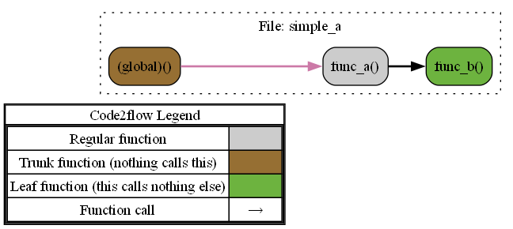
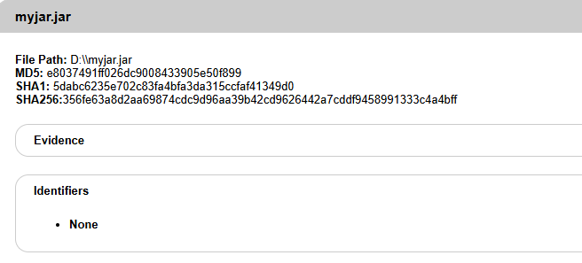

# code2flow-in-java   
## Introduction
&emsp;&emsp;This project implements Code2flow using the Java language.
&emsp;&emsp;Code2flow is a Python-based code visualization tool. Its core capability lies in constructing function call graphs by parsing abstract syntax trees (AST), supporting dynamic languages such as Python, JavaScript, Ruby, and PHP. By analyzing the abstract syntax tree (AST) of the code, it automatically generates flowcharts or call graphs, visually displaying function calls, conditional branches (e.g., if/else), loop structures (e.g., for/while), and other logic. It can analyze individual files or entire project directories, recursively identifying cross-file function call chains, and supports exporting to formats such as PNG, SVG, and PDF.  

The tool provides both a command-line interface and a programming API, allowing customization of flowchart styles (e.g., node colors, layout direction) and filtering mechanisms (e.g., excluding test files or redundant functions). It is suitable for scenarios such as code review, teaching demonstrations, and project architecture analysis.

&emsp;&emsp;With the ongoing contributions from the developer community, future plans include expanding language support to break through current limitations, exploring compatibility with compiled languages such as C++ and Go. This will gradually evolve the tool into a universal code logic analysis platform, providing a comprehensive view of call dependencies for multi-language hybrid projects.

## Core Features
### 1. Convert source code files into syntax trees.
&emsp;&emsp;When converting source code into a syntax tree, the parser performs lexical analysis and syntactic analysis on the code to generate an Abstract Syntax Tree (AST). Each node in the AST corresponds to a specific element in the code (e.g., functions, variables, conditional branches) and records its syntactic structural relationships.  The process involves handling language-specific syntax rules (e.g., Python indentation, Ruby block syntax). By traversing the AST, the tool identifies the locations and scopes of function definitions while also marking contextual information.
### 2.​Identify all function definitions
&emsp;&emsp;When traversing the Abstract Syntax Tree (AST), the tool identifies function definition nodes based on language-specific features, such as Python's def keyword. The parser extracts the function name, parameter list, and scope, while also handling nested definitions. During this process, it establishes a mapping between functions and their associated namespaces (e.g., modules, classes) and records their definition locations to facilitate subsequent cross-file call analysis.
### 3. ​Identifying Function Call Locations
&emsp;&emsp;When locating function calls in the AST, the tool traverses all call expression nodes and parses the caller name and arguments. For explicit calls, the function name is directly extracted. For object-oriented languages, it identifies class method calls (e.g., obj.method()) and associates them with their owning class.Potential mislinks may occur between standard library/external functions and local functions with the same name (e.g., mistakenly linking searcher.search() to a local search()). Cross-file calls require explicit source file specification. Dynamic language features (e.g., eval/send) rely on heuristic rules and cannot guarantee complete accuracy.
### 4.Connecting Nodes
&emsp;&emsp;Based on the AST, explicit call edges are established, handling inheritance (linking methods via explicit parent class declarations) and decorators (unidirectional associations). Cross-file calls only recognize import/require paths, while dynamic methods (e.g., apply) infer targets through static variable name matching.The output includes basic call chains (with potential false positives), excluding dynamic calls like closures or conditional triggers. No placeholder nodes or topological optimizations are added to ensure concise and reversible results.
## Application Scenarios
### Identifying Unused Functions
&emsp;&emsp;The tool automatically scans project code to detect unused components, such as isolated functions or modules. These uncalled code segments often occupy storage space and increase maintenance complexity. By accurately identifying and removing them, the codebase can be streamlined to avoid resource waste.
### Accelerating Onboarding for New Developers
&emsp;&emsp;For developers joining a project, complex code logic can be daunting. Code2flow generates clear diagrams that visually map call paths and hierarchical relationships between functional modules, serving as a "code roadmap" for newcomers. This approach reduces communication overhead and shortens the learning curve.
### Detecting High-Risk Functions
&emsp;&emsp;During testing and review phases, the tool traces potentially problematic code segments, such as function call chains involving sensitive operations. Through visual analysis, teams can quickly pinpoint high-risk nodes for prioritized review or reinforcement, thereby enhancing system stability.

## Innovations and Optimizations
&emsp;&emsp;This project significantly extends the original work by adding support for Java, expanding call graph generation capabilities from dynamic languages to statically-typed languages.

&emsp;&emsp;While preserving the core functionality of the original, the project achieves comprehensive upgrades through static type checking, performance optimization, and modular design. By adapting to Java's strict type system and class inheritance structures, it enables precise parsing of object-oriented programming paradigms—such as tracking interface implementations and polymorphic method call chains—while maintaining compatibility with dynamic language features.

&emsp;&emsp;The static type system performs rigorous validation of parameter types, collection operations, and interface calls during compilation, avoiding runtime issues like attribute errors or type mismatches common in Python. This type safety is particularly beneficial for large-scale codebases, significantly improving robustness. It also enables performance optimizations: leveraging accurate type inference, the code employs stream processing for parallelized AST parsing and call relationship construction. Combined with LinkedHashSet to minimize hash collisions during node traversal, processing efficiency is enhanced. Additionally, timeout controls and asynchronous I/O when interfacing with Graphviz prevent blocking, ensuring stable output.

&emsp;&emsp;Architecturally, deep decoupling is achieved through factory patterns and interface abstraction. Multilingual parsing logic is unified under the LanguageProcessor interface, where different languages need only implement standardized methods (e.g., AST separation, node generation) for seamless integration—without modifying core flowchart generation logic. This modular design, coupled with Java's strong typing, isolates components like parameter parsers, namespace filters, and subgraph generators into independent units. Clear type contracts reduce inter-module coupling, ensuring system stability while providing standardized extension points for future language support and customizable filtering rules.


## Download Tools and Dependencies
### graphviz
If you haven't installed this diagramming tool, you can find download instructions[here](https://graphviz.org/download/)
### Acorn
If you haven't installed the JavaScript parsing dependency, you can find download instructions[here](https://www.npmjs.com/package/acorn)
### Parser
If you haven't installed the Ruby parsing dependency, you can find download instructions[here](https://github.com/whitequark/parser)
### PHP-Parser
If you haven't installed the PHP parsing dependency, you can find download instructions[here](https://github.com/nikic/PHP-Parser)
## Usage
Taking JavaScript as an example:  

To generate a DOT file, run the following command:
```bash
java -jar code2flow-in-java.jar 1.js
```
To process multiple files, run either of these commands:
```bash
java -jar code2flow-in-java.jar 2.js 3.js
```
or
```bash
java -jar code2flow-in-java.jar directory --language js
```
or
```bash
java -jar code2flow-in-java.jar *.js
```
To extract a specific subgraph from the complete call graph, run:
```bash
java -jar code2flow-in-java.jar 4.js --target-function my_func --upstream-depth=1 --downstream-depth=1
```
For assistance, run the help command:
```bash
java -jar code2flow-in-java.jar --help
```
# Unit Testing
[Unit Testing](/单元测试.pdf)
# Integration Testing
## Generating Function Call Graphs for JavaScript Code
### JavaScript Example 1
```
function func_b() {}

function func_a() {
    func_b();
}
```
### To generate a DOT file
```
digraph G {
concentrate=true;
splines="ortho";
rankdir="LR";
subgraph legend{
    rank = min;
    label = "legend";
    Legend [shape=none, margin=0, label = <
        <table cellspacing="0" cellpadding="0" border="1"><tr><td>Code2flow Legend</td></tr><tr><td>
        <table cellspacing="0">
        <tr><td>Regular function</td><td width="50px" bgcolor='#cccccc'></td></tr>
        <tr><td>Trunk function (nothing calls this)</td><td bgcolor='#966F33'></td></tr>
        <tr><td>Leaf function (this calls nothing else)</td><td bgcolor='#6db33f'></td></tr>
        <tr><td>Function call</td><td><font color='black'>&#8594;</font></td></tr>
        </table></td></tr></table>
        >];
}node_be42227a [label="3: func_a()" name="simple_a::func_a" shape="rect" style="rounded,filled" fillcolor="#966F33" ];
node_b2c75cd6 [label="1: func_b()" name="simple_a::func_b" shape="rect" style="rounded,filled" fillcolor="#6db33f" ];
node_be42227a -> node_b2c75cd6 [color="#56B4E9" penwidth="2"];
subgraph cluster_0a0ef935 {
    node_b2c75cd6 node_be42227a;
    label="File: simple_a";
    name="simple_a";
    style="filled";
    graph[style=dotted];
};
}
```
### Generated Function Call Diagram


  
###JavaScript Code Example 2
```
function a() {
    b();
}


function b() {
    a("STRC #");
}


class C {
    d(param) {
        a("AnotherSTR");
    }
}

const c = new C()
c.d()
```
### To generate a DOT file
```
digraph G {
concentrate=true;
splines="ortho";
rankdir="LR";
subgraph legend{
    rank = min;
    label = "legend";
    Legend [shape=none, margin=0, label = <
        <table cellspacing="0" cellpadding="0" border="1"><tr><td>Code2flow Legend</td></tr><tr><td>
        <table cellspacing="0">
        <tr><td>Regular function</td><td width="50px" bgcolor='#cccccc'></td></tr>
        <tr><td>Trunk function (nothing calls this)</td><td bgcolor='#966F33'></td></tr>
        <tr><td>Leaf function (this calls nothing else)</td><td bgcolor='#6db33f'></td></tr>
        <tr><td>Function call</td><td><font color='black'>&#8594;</font></td></tr>
        </table></td></tr></table>
        >];
}node_4d80af57 [label="0: (global)()" name="simple_b::(global)" shape="rect" style="rounded,filled" fillcolor="#966F33" ];
node_6f8efa78 [label="14: d()" name="simple_b::C.d" shape="rect" style="rounded,filled" fillcolor="#cccccc" ];
node_5b298643 [label="3: a()" name="simple_b::a" shape="rect" style="rounded,filled" fillcolor="#cccccc" ];
node_47f04d1e [label="8: b()" name="simple_b::b" shape="rect" style="rounded,filled" fillcolor="#cccccc" ];
node_4d80af57 -> node_6f8efa78 [color="#CC79A7" penwidth="2"];
node_6f8efa78 -> node_5b298643 [color="#000000" penwidth="2"];
node_5b298643 -> node_47f04d1e [color="#009E73" penwidth="2"];
node_47f04d1e -> node_5b298643 [color="#D55E00" penwidth="2"];
subgraph cluster_df41c0e0 {
    node_5b298643 node_47f04d1e node_4d80af57;
    label="File: simple_b";
    name="simple_b";
    style="filled";
    graph[style=dotted];
    subgraph cluster_ac24255b {
        node_6f8efa78;
        label="Class: C";
        name="C";
        style="filled";
        graph[style=dotted];
    };
};
}
```
### Generated Function Call Diagram

  
  


## Python Code to Function Call Graph Generation
### Python Code Example 1

```
def func_b():
    pass

def func_a():
    func_b()
```
###  To generate a DOT file
```
digraph G {
concentrate=true;
splines="ortho";
rankdir="LR";
subgraph legend{
    rank = min;
    label = "legend";
    Legend [shape=none, margin=0, label = <
        <table cellspacing="0" cellpadding="0" border="1"><tr><td>Code2flow Legend</td></tr><tr><td>
        <table cellspacing="0">
        <tr><td>Regular function</td><td width="50px" bgcolor='#cccccc'></td></tr>
        <tr><td>Trunk function (nothing calls this)</td><td bgcolor='#966F33'></td></tr>
        <tr><td>Leaf function (this calls nothing else)</td><td bgcolor='#6db33f'></td></tr>
        <tr><td>Function call</td><td><font color='black'>&#8594;</font></td></tr>
        </table></td></tr></table>
        >];
}node_46f43649 [label="4: func_a()" name="simple_a::func_a" shape="rect" style="rounded,filled" fillcolor="#966F33" ];
node_b94c9ac3 [label="1: func_b()" name="simple_a::func_b" shape="rect" style="rounded,filled" fillcolor="#6db33f" ];
node_46f43649 -> node_b94c9ac3 [color="#E69F00" penwidth="2"];
subgraph cluster_a3022c52 {
    node_b94c9ac3 node_46f43649;
    label="File: simple_a";
    name="simple_a";
    style="filled";
    graph[style=dotted];
};
}
```
### Generated Function Call Diagram

  
### python Code Example 2
```
def a():
    b()
# comments
def b():
    a("""STRC #""")
class c():
    def d(a="String"):
        a("AnotherSTR")
c.d()
```
###  To generate a DOT file
```
digraph G {
concentrate=true;
splines="ortho";
rankdir="LR";
subgraph legend{
    rank = min;
    label = "legend";
    Legend [shape=none, margin=0, label = <
        <table cellspacing="0" cellpadding="0" border="1"><tr><td>Code2flow Legend</td></tr><tr><td>
        <table cellspacing="0">
        <tr><td>Regular function</td><td width="50px" bgcolor='#cccccc'></td></tr>
        <tr><td>Trunk function (nothing calls this)</td><td bgcolor='#966F33'></td></tr>
        <tr><td>Leaf function (this calls nothing else)</td><td bgcolor='#6db33f'></td></tr>
        <tr><td>Function call</td><td><font color='black'>&#8594;</font></td></tr>
        </table></td></tr></table>
        >];
}node_76cca4f3 [label="0: (global)()" name="simple_b::(global)" shape="rect" style="rounded,filled" fillcolor="#966F33" ];
node_5c57cc6c [label="6: a()" name="simple_b::a" shape="rect" style="rounded,filled" fillcolor="#cccccc" ];
node_abb11264 [label="11: b()" name="simple_b::b" shape="rect" style="rounded,filled" fillcolor="#cccccc" ];
node_4410db85 [label="16: d()" name="simple_b::c.d" shape="rect" style="rounded,filled" fillcolor="#cccccc" ];
node_76cca4f3 -> node_4410db85 [color="#009E73" penwidth="2"];
node_5c57cc6c -> node_abb11264 [color="#F0E442" penwidth="2"];
node_abb11264 -> node_5c57cc6c [color="#F0E442" penwidth="2"];
node_4410db85 -> node_5c57cc6c [color="#0072B2" penwidth="2"];
subgraph cluster_55bf0f76 {
    node_5c57cc6c node_abb11264 node_76cca4f3;
    label="File: simple_b";
    name="simple_b";
    style="filled";
    graph[style=dotted];
    subgraph cluster_061a6bc6 {
        node_4410db85;
        label="Class: c";
        name="c";
        style="filled";
        graph[style=dotted];
    };
};
}
```
### Generated Function Call Diagram
  
  
  
###Converted the original code2flow model.py into a function call relationship graph
  

## PHPCode to Function Call Graph Generation
### PHP Code Example 1

```
<?php
function func_b() {
    echo "hello world";
}
function func_a() {
    func_b();
}
func_a();
?>
```
###  To generate a DOT file
```
digraph G {
concentrate=true;
splines="ortho";
rankdir="LR";
subgraph legend{
    rank = min;
    label = "legend";
    Legend [shape=none, margin=0, label = <
        <table cellspacing="0" cellpadding="0" border="1"><tr><td>Code2flow Legend</td></tr><tr><td>
        <table cellspacing="0">
        <tr><td>Regular function</td><td width="50px" bgcolor='#cccccc'></td></tr>
        <tr><td>Trunk function (nothing calls this)</td><td bgcolor='#966F33'></td></tr>
        <tr><td>Leaf function (this calls nothing else)</td><td bgcolor='#6db33f'></td></tr>
        <tr><td>Function call</td><td><font color='black'>&#8594;</font></td></tr>
        </table></td></tr></table>
        >];
}node_17811b20 [label="11: (global)()" name="simple_a::(global)" shape="rect" style="rounded,filled" fillcolor="#966F33" ];
node_4d037a7a [label="7: func_a()" name="simple_a::func_a" shape="rect" style="rounded,filled" fillcolor="#cccccc" ];
node_4920683e [label="3: func_b()" name="simple_a::func_b" shape="rect" style="rounded,filled" fillcolor="#6db33f" ];
node_17811b20 -> node_4d037a7a [color="#000000" penwidth="2"];
node_4d037a7a -> node_4920683e [color="#56B4E9" penwidth="2"];
subgraph cluster_c960d576 {
    node_4920683e node_4d037a7a node_17811b20;
    label="File: simple_a";
    name="simple_a";
    style="filled";
    graph[style=dotted];
};
}
```
### Generated Function Call Diagram
  
  
  
### PHP Code Example 2
```
<?php
require __DIR__.'/../vendor/autoload.php';
function a($param) {
    b($param);
}
function b() {
    a("STRC #");
}
class C {
    function d($param) {
        a("AnotherSTR");
    }
}
$c = new C();
$c->d();
?>
```
###  To generate a DOT file
```
digraph G {
concentrate=true;
splines="ortho";
rankdir="LR";
subgraph legend{
    rank = min;
    label = "legend";
    Legend [shape=none, margin=0, label = <
        <table cellspacing="0" cellpadding="0" border="1"><tr><td>Code2flow Legend</td></tr><tr><td>
        <table cellspacing="0">
        <tr><td>Regular function</td><td width="50px" bgcolor='#cccccc'></td></tr>
        <tr><td>Trunk function (nothing calls this)</td><td bgcolor='#966F33'></td></tr>
        <tr><td>Leaf function (this calls nothing else)</td><td bgcolor='#6db33f'></td></tr>
        <tr><td>Function call</td><td><font color='black'>&#8594;</font></td></tr>
        </table></td></tr></table>
        >];
}node_084e1b8c [label="3: (global)()" name="simple_b::(global)" shape="rect" style="rounded,filled" fillcolor="#966F33" ];
node_dc20558f [label="16: d()" name="simple_b::C.d" shape="rect" style="rounded,filled" fillcolor="#cccccc" ];
node_e165d5b1 [label="5: a()" name="simple_b::a" shape="rect" style="rounded,filled" fillcolor="#cccccc" ];
node_511665c4 [label="10: b()" name="simple_b::b" shape="rect" style="rounded,filled" fillcolor="#cccccc" ];
node_084e1b8c -> node_dc20558f [color="#F0E442" penwidth="2"];
node_dc20558f -> node_e165d5b1 [color="#CC79A7" penwidth="2"];
node_e165d5b1 -> node_511665c4 [color="#E69F00" penwidth="2"];
node_511665c4 -> node_e165d5b1 [color="#F0E442" penwidth="2"];
subgraph cluster_58705a56 {
    node_e165d5b1 node_511665c4 node_084e1b8c;
    label="File: simple_b";
    name="simple_b";
    style="filled";
    graph[style=dotted];
    subgraph cluster_af2ec5f6 {
        node_dc20558f;
        label="Class: C";
        name="C";
        style="filled";
        graph[style=dotted];
    };
};
}
```
### Generated Function Call Diagram
  


## Ruby Code to Function Call Graph Generation
### ruby Code Example 1
```
def func_b(var)
    puts "hello world"
end

def func_a()
    func_b()
end

func_a()

```
###  To generate a DOT file
```
digraph G {
concentrate=true;
splines="ortho";
rankdir="LR";
subgraph legend{
    rank = min;
    label = "legend";
    Legend [shape=none, margin=0, label = <
        <table cellspacing="0" cellpadding="0" border="1"><tr><td>Code2flow Legend</td></tr><tr><td>
        <table cellspacing="0">
        <tr><td>Regular function</td><td width="50px" bgcolor='#cccccc'></td></tr>
        <tr><td>Trunk function (nothing calls this)</td><td bgcolor='#966F33'></td></tr>
        <tr><td>Leaf function (this calls nothing else)</td><td bgcolor='#6db33f'></td></tr>
        <tr><td>Function call</td><td><font color='black'>&#8594;</font></td></tr>
        </table></td></tr></table>
        >];
}node_7546bceb [label="(global)()" name="simple_a::(global)" shape="rect" style="rounded,filled" fillcolor="#966F33" ];
node_c0fac9c5 [label="func_a()" name="simple_a::func_a" shape="rect" style="rounded,filled" fillcolor="#cccccc" ];
node_1dacc838 [label="func_b()" name="simple_a::func_b" shape="rect" style="rounded,filled" fillcolor="#6db33f" ];
node_7546bceb -> node_c0fac9c5 [color="#009E73" penwidth="2"];
node_c0fac9c5 -> node_1dacc838 [color="#0072B2" penwidth="2"];
subgraph cluster_68d4a0e1 {
    node_1dacc838 node_c0fac9c5 node_7546bceb;
    label="File: simple_a";
    name="simple_a";
    style="filled";
    graph[style=dotted];
};
}
```
### Generated Function Call Diagram
  
  
  
### rubyCode Example 2
```
def a()
    b()
end
# comments
def b()
    a("""STRC #""")
end
class Cls
    def initialize(val)
        @val = val
    end
    def d(a="String")
        a("AnotherSTR")
    end
end
c = Cls.new()
c.d()
```
###  To generate a DOT file
```
digraph G {
concentrate=true;
splines="ortho";
rankdir="LR";
subgraph legend{
    rank = min;
    label = "legend";
    Legend [shape=none, margin=0, label = <
        <table cellspacing="0" cellpadding="0" border="1"><tr><td>Code2flow Legend</td></tr><tr><td>
        <table cellspacing="0">
        <tr><td>Regular function</td><td width="50px" bgcolor='#cccccc'></td></tr>
        <tr><td>Trunk function (nothing calls this)</td><td bgcolor='#966F33'></td></tr>
        <tr><td>Leaf function (this calls nothing else)</td><td bgcolor='#6db33f'></td></tr>
        <tr><td>Function call</td><td><font color='black'>&#8594;</font></td></tr>
        </table></td></tr></table>
        >];
}node_df0b6deb [label="(global)()" name="simple_b::(global)" shape="rect" style="rounded,filled" fillcolor="#966F33" ];
node_20a304f1 [label="d()" name="simple_b::Cls.d" shape="rect" style="rounded,filled" fillcolor="#cccccc" ];
node_a41a3668 [label="initialize()" name="simple_b::Cls.initialize" shape="rect" style="rounded,filled" fillcolor="#6db33f" ];
node_4b7c81a0 [label="a()" name="simple_b::a" shape="rect" style="rounded,filled" fillcolor="#cccccc" ];
node_3625bdca [label="b()" name="simple_b::b" shape="rect" style="rounded,filled" fillcolor="#cccccc" ];
node_df0b6deb -> node_20a304f1 [color="#009E73" penwidth="2"];
node_df0b6deb -> node_a41a3668 [color="#009E73" penwidth="2"];
node_20a304f1 -> node_4b7c81a0 [color="#E69F00" penwidth="2"];
node_4b7c81a0 -> node_3625bdca [color="#000000" penwidth="2"];
node_3625bdca -> node_4b7c81a0 [color="#56B4E9" penwidth="2"];
subgraph cluster_cea84f70 {
    node_4b7c81a0 node_3625bdca node_df0b6deb;
    label="File: simple_b";
    name="simple_b";
    style="filled";
    graph[style=dotted];
    subgraph cluster_ee80f463 {
        node_a41a3668 node_20a304f1;
        label="Class: Cls";
        name="Cls";
        style="filled";
        graph[style=dotted];
    };
};
}
```
### Generated Function Call Diagram
  


# Security Testing
We conducted a comprehensive security vulnerability scan on the JAR file generated by this project using the popular open-source Software Composition Analysis (SCA) tool, OWASP Dependency-Check. The tool follows a systematic detection process:
1.Dependency fingerprint identification
​2.Vulnerability database comparison
​3.Risk analysis report generation

### The final risk analysis report includes:
* ​Dependency vulnerability topology graph
* ​License compliance analysis
* Vulnerability timeline tracking

  
  
  

The risk analysis report generated by Dependency-Check reveals that the vulnerabilities in the project are primarily concentrated in the JSON libraries. However, the attack methods associated with these CVE vulnerabilities are all ​server-side Denial-of-Service (DoS). Since this project is a ​localized end-user application with no exposed network services, all JSON processing runs in a ​closed environment, making it impossible for malicious attacks to occur.
After security evaluation, we conclude that these vulnerabilities ​pose no actual risk to this project. Users can safely use the current version.